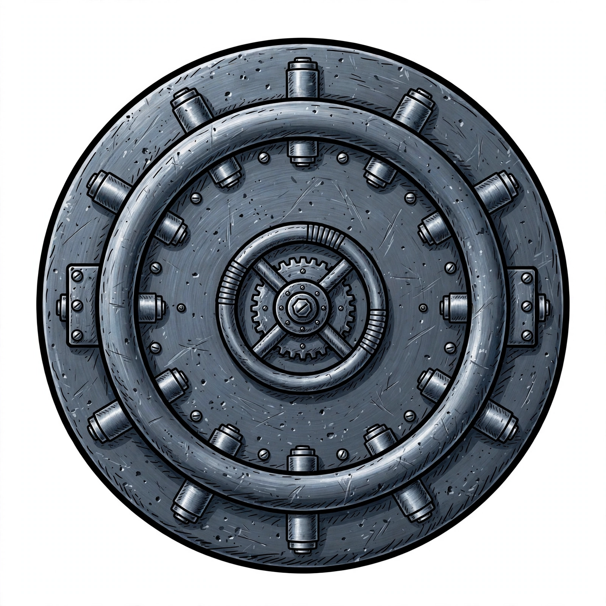

# FileKeep



**Encrypted backups that live on Usenet.** FileKeep is an open-source Windows backup application that encrypts your files client-side and stores them as ordinary Usenet articles — no cloud subscription, no vendor lock-in, just your data, retrievable from any Usenet provider with enough retention.

[](LICENSE)
[]()
[]()

## What it does

- **Full and incremental backups** of directories and whole disks, with content-defined chunking and cross-backup deduplication
- **Client-side authenticated encryption** (AES-256-GCM) — the passphrase never leaves your machine and is never stored with the backup data
- **Usenet as storage** — chunks are posted as yEnc articles to any NNTP provider; NZB indexes track them
- **Volume Shadow Copy (VSS)** snapshots for point-in-time backups of open and locked files — available via `backup --vss` and per scheduled job (`"vss": true` in service config)
- **Reed–Solomon parity** for recovery from damaged or missing articles
- **Retention management** — monitors article age against provider retention and reposts with fresh identities before articles expire
- **Windows service + web dashboard** for scheduled backups, styled like Windows Settings with dark-mode support
- **Bootable WinRE recovery USB** (Windows 95 Setup-style wizard) for bare-metal restores — built ADK-free from the host's own WinRE image
- **LAN mode** — serve a repository over HTTP so a recovery stick can pull from your NAS instead of re-downloading from Usenet

## Installation

Download `filekeep-0.8.1.msi` and run it. Installs to `C:\Program Files\FileKeep\`:

| Path | Contents |
|------|----------|
| `cli\FileKeep.exe` | Command-line interface |
| `cli\FileKeepVss.exe` | Native VSS snapshot helper |
| `service\FileKeepService.exe` | Windows service + web dashboard |
| `wizard\FileKeepRecovery.exe` | Recovery wizard (also used in WinRE) |
| `docs\` | Recovery runbook and format docs |

The installer registers the `FileKeep` service (starts on first boot) and otherwise stays out of your way — no Start Menu clutter, no tray icon.

## Quick start

```powershell
# 1. Create a repository (passphrase via env var — never on the command line)
$env:USENETBACKUP_PASSPHRASE = "your-passphrase"
FileKeep.exe init C:\backups\repo

# 2. Back up a directory (incremental against the previous backup)
FileKeep.exe backup C:\backups\repo C:\Users\you\Documents --parent <previous-backup-id>

# 3. Upload to Usenet
$env:USENETBACKUP_NNTP_PASSWORD = "your-nntp-password"
FileKeep.exe nntp-upload C:\backups\repo <backup-id> --host news.example.com --user youruser

# 4. Generate an NZB index for the backup
FileKeep.exe nzb-generate C:\backups\repo <backup-id> backup.nzb

# 5. On another machine: download and restore
FileKeep.exe download C:\backups\repo2 backup.nzb --host news.example.com --user youruser
FileKeep.exe verify C:\backups\repo2 <backup-id>
FileKeep.exe restore C:\backups\repo2 <backup-id> C:\restored
```

More commands: `backup-disk` / `restore-disk` (whole-disk imaging), `nntp-check` (connection test; `--diagnose` probes 119/563/443 with classified failures and falls back to a free server to distinguish ISP blocking from provider issues), `retention-check` (article-age audit with `--dry-run`), `serve` (LAN repository server), `smb-sync`, `expiration-check`, `list`.

Backing up locked files (databases, Outlook PSTs, etc.):

```powershell
# As administrator: enables SeBackupPrivilege to read exclusively-locked files
FileKeep.exe backup C:\backups\repo C:\data --backup-privilege

# Point-in-time VSS shadow copy (Windows only, admin required).
# The service also supports VSS per scheduled job via the "vss" config flag.
FileKeep.exe backup C:\backups\repo C:\data --vss
```

## Components

| Component | Description |
|-----------|-------------|
| **CLI** (`FileKeep.exe`) | Full backup/restore/verify/upload/download/NZB/retention toolkit for automation and scripts |
| **Service** (`FileKeepService.exe`) | Windows service running scheduled jobs from `service.json`; serves the dashboard at `http://127.0.0.1:15789/` |
| **Dashboard** | Web UI in the Windows Settings visual language, with OS dark-mode support: job status, run-now, backup lists, operations log, Usenet provider config (passwords stored via DPAPI, never exposed to the UI) |
| **Recovery wizard** (`FileKeepRecovery.exe`) | Windows 95 Setup-style step-through: unlock repo → pick backup → download → verify → restore |
| **VSS helper** (`FileKeepVss.exe`) | Minimal native helper implementing the full VSS backup lifecycle (`GatherWriterMetadata` → `PrepareForBackup` → `DoSnapshotSet` → `BackupComplete`/`AbortBackup`), so writers like SQL Server are never left in a dangling backup state |
| **WinRE USB** | Bootable recovery environment containing the CLI, recovery wizard, and runbook — built ADK-free from the host's WinRE image |

### Recovery USB

Build bootable recovery media from the dashboard (**Recovery** → **Build WinRE recovery media**) or with `winre\build-winre-usb.ps1` (run as admin, no ADK required). The script formats the target USB drive and installs the customized WinRE image with FileKeep tools.

Only USB-attached drives are eligible targets; the command refuses fixed drives, checks the ISO fits, and declines when stdin isn't interactive (unless `--yes`).

## How it works

1. **Chunk** — files are split into content-defined chunks (~4 MB default), hashed with SHA-256; identical chunks across backups are stored once
2. **Encrypt** — each chunk is encrypted with AES-256-GCM under a key derived from your passphrase (PBKDF2-HMAC-SHA-512, 600k iterations)
3. **Parity** — Reed–Solomon parity shards are generated per chunk group for damage recovery
4. **Post** — chunks go up as yEnc NNTP articles with deterministic message-IDs; uploads resume after interruption via a local journal plus server STAT checks
5. **Index** — an NZB 1.1 file maps chunks to articles; the encrypted manifest is also posted so the recovery wizard can discover backups newer than your USB stick
6. **Retain** — a retention manager periodically STATs a sample of articles (default 10 per backup — a lightweight health check, not a proof that every article survives) against provider retention. If any sampled article is missing or the backup nears expiry, *all* chunks are republished under fresh message-IDs before the retention clock resets; a partial failure leaves the old timestamp in place so the next run retries
7. **Restore** — download via NZB, per-chunk authentication and hash verification, decrypt, reassemble; `verify` proves integrity independently of the backup that created it

Every backup is independently verifiable, every uploaded object carries a cryptographic hash, and interrupted uploads/downloads resume where they left off.

## Security model

- **Passphrase handling.** The key is derived at runtime and zeroed on dispose; it is never written to the repository. Prefer the `USENETBACKUP_PASSPHRASE` environment variable or the interactive prompt — `--passphrase` on the command line is visible in the process list (the CLI warns about this).
- **What's public.** Chunk message-IDs embed the SHA-256 of the plaintext chunk (required for content addressing and dedup). Ciphertext is safe, but anyone with an NZB can confirm guesses about plaintext. Filenames are plaintext in manifests (a v1 tradeoff for independent verifiability). There is no forward secrecy: a compromised passphrase decrypts all past Usenet posts.
- **Dashboard.** Binds to loopback only. NNTP passwords are stored via Windows DPAPI and never exposed to the UI.
- **Destructive commands.** `restore-disk` overwrites a block device; it requires typing the device path to confirm (or `--yes` for scripts).
- **Dependencies.** `dotnet list package --vulnerable` is clean (SQLitePCLRaw CVE-2025-6965 patched via upgrade to 2.1.12).

## Backup format

`BACKUP FORMAT v1` is frozen and documented in [`docs/FORMAT-v1.md`](docs/FORMAT-v1.md). Future versions add `v2`, `v3` readers — they never silently change `v1`. Additional docs:

- [`docs/RECOVERY.md`](docs/RECOVERY.md) — bare-metal recovery runbook
- [`docs/VSS-DESIGN.md`](docs/VSS-DESIGN.md) — VSS snapshot lifecycle design
- [`docs/ROADMAP.md`](docs/ROADMAP.md) — where the project is headed

## Development

```sh
dotnet build FileKeep.slnx
dotnet test FileKeep.slnx   # 194/194 on Windows
```

The core engine builds and tests cross-platform; Windows-only paths (backup privilege, VSS helper, service hosting, WiX installer) need a Windows 10/11 machine. The service also runs in `--console` mode on any OS for development.

Key engineering rules for contributors:

- No hand-rolled crypto — established, boring, conventional implementations only
- Never store encryption keys with backup data
- Every backup independently verifiable; every uploaded object hashed
- Interrupted transfers resume; no silent data deletion
- All modules have automated tests; nothing merges red

## Status

FileKeep is in active development (v0.8.1). The full backup → Usenet upload → download → verify → restore loop is validated against a live Usenet provider. Retention management, Reed–Solomon parity, the Windows service/dashboard, VSS snapshots (CLI `--vss` and scheduled-job `"vss"` flag), and the WinRE recovery environment are implemented and tested.

On the roadmap: merge/selective restore (deferred to v2), scheduled deep verification, and broader provider compatibility testing.

## License

GPL-3.0-only — see [LICENSE](LICENSE). Copyright © 2026 J. Treichel.

FileKeep is free software: you can redistribute it and/or modify it under the terms of the GNU General Public License as published by the Free Software Foundation, **version 3 of the License only** (no "or later" option). Anyone distributing FileKeep or modified versions must make the corresponding source available under the same terms.

Note: versions of FileKeep released under the MIT license (up to and including 0.8.1) remain available under those MIT terms; the GPL-3.0-only license applies from this version forward.
